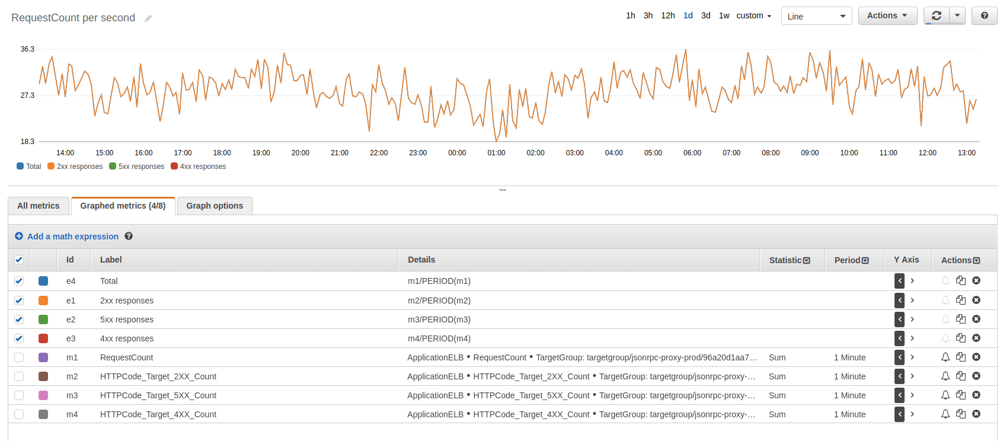
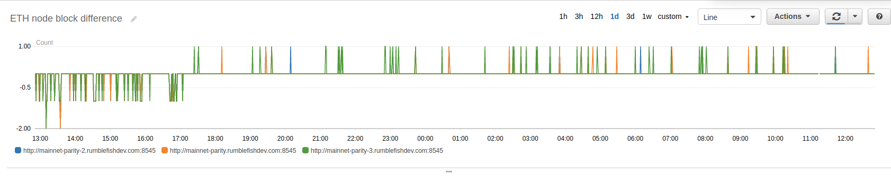
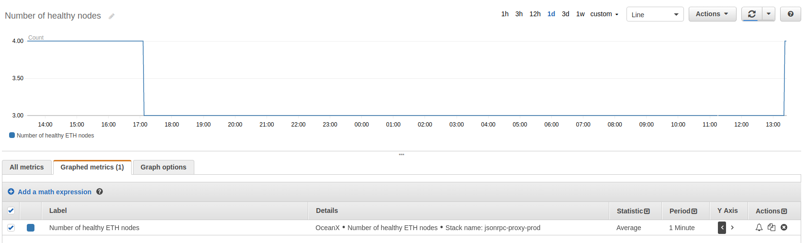

# How to build your own Infura on AWS using serverless framework

In [one of previous articles](https://www.rumblefishdev.com/how-to-run-ethereum-mainnet-node-on-aws/)
we've demonstrated how to run a single mainnet Parity node on AWS. In many cases having one Parity
node will be sufficient, it surely beats a need to rely on external public infrastracture, like Infura.

## Drawbacks of having only one node

However in many situations one node is simply not enough. I can think of several reasons why you may need more than one node.

1. **Downtime**. If for any reason node has to be taken down for maintenance there will be no node left.
There will be downtime when for example there is a need to upgrade a version of Parity.

2. **Falling out of sync**. Parity is great but not flaweless. It may occasionally fall out of sync
for various reasons. Having multiple nodes allows us to temporarly re-route traffic from nodes which
have fallen behind and query nodes which are in-sync.

3. **Distributing load**. There is only a certain level of requests/second on json-rpc that a single
Parity node can sustain. Json-rpc interface becomes slow over this level and Parity node falls out of
sync. This is especially important if node(s) is used from web dapp interface and number, and you
can observe daily spikes in user engagement.

## Infrastructure of jsonrpc-proxy

Big picture of what proxy does goes as follows:

1. A list of URL of out Parity node should be kept in DynamoDB. There is also a special URL called
*leader* that points to Infura.

2. `eth_getBlockNumber` should be run on each of the nodes from the list every 60 seconds. The result is
compared with the *leader*. For the node to be deemed healthy it has to respond and be no more than
10 blocks behind Infura. The *health status* of each node is saved to DynamoDB.

3. Change of health status of any node triggers regeneration of proxy config. Proxy config is simply
an nginx `.conf` file that configures an upstream service which load-balances load between our nodes.
If none of our nodes is healthy the generated config proxies all requests to Infura as
a fallback. The config file is uploaded to S3 bucket.

4. Uploading config file to S3 bucket triggers update of ECS Service that runs *nginx* container with
generated config.

### Monitoring nodes

The upside of using AWS services is that they come with default metrics out-of-box.

#### Requests per second

Using built-in ELB metrics we can see the brakedown of requests coming to the proxy per response
status codes.

#### Lateness to Infura

Also jsonrpc-proxy stack pushes it's own metrics that shows diff between each node block number
and Infura.

#### Number of healthy nodes

Another custom metric shows number of healthy nodes.

This metric is very useful for setting a CloudWatch alarm.

## Deploying your own jsonrpc-proxy

The code of our solution can be found in [git repository](https://github.com/rumblefishdev/jsonrpc-proxy).

### Build ECR container with nginx

Our service runs `nginx` container on ECS cluster which fetches its config from S3 bucket. The
image of this service needs to be available on some AWS account as jsonrpc-proxy. You can build
and upload image with following commands:

    $ cd docker
    $ AWS_DEFAULT_PROFILE=yourProfileName bash -x build_and_upload.sh

This will create an ECR repository, build image and push it. In the result you will see the ARN
of created ECR repository that you need to put into config file in the next step.

Written above assumes that you use named profiles for command-line access. If you use session tokens skip
the profile part.

### Create config file

The stack is done so that it re-uses external resources that have to be passed as parameter in
the config file. You can start by creating your own config file from the template provided:

    $ cd services
    $ cp config.yml.sample config.dev.yml # this assumes `dev` as stage name to be used later

Edit the file and specify inside:

* VPC you run in and subnet ids of private subnets

* List the security groups allowing access to all the Parity nodes

* ECS Cluster and Application Load Balancer. The stack creates neither own cluster nor load balancer,
because typically you will not want to pay for dedicated resources just to run `nginx` inside.
*Please note*: it's necessary that ECS cluster is added to security groups allowing it to access Parity nodes

* ERC Image ARN created in previous step

### Deploy stack

You will need to have `serverless` installed on your machine.

    npm install -g serverless

Than you need to install stack dependencies:

    cd services
    npm install

Once this is done you can deploy stack to your AWS account:

    $ AWS_DEFAULT_PROFILE=yourProfileName sls deploy -s dev

Finally you need to configure your DNS to point the name used by stack to your Application Load Balancer.

### Add nodes to monitor

Next step is to actually tell the proxy what nodes to monitor:

    $ DATA='{"body":"{\"url\":\"https://kovan.infura.io/kb56QStVQWIFv1n5fRfn\",\"is_leader\":true}"}'
    $ sls invoke -f add_backend -d $DATA -s dev
    {
      "statusCode": 201,
      "body": "{\"url\": \"https://kovan.infura.io/kb56QStVQWIFv1n5fRfn\", \"is_leader\": true, \"is_healthy\": false, \"when_added\": \"2018-07-02T11:50:47.762447\"}"
    }

    $ DATA='{"body":"{\"url\":\"http://kovan-parity-1.rumblefishdev.com:8545\",\"is_leader\":false}"}'
    $ sls invoke -f add_backend -d $DATA -s dev
    {
      "statusCode": 201,
      "body": "{\"url\": \"http://kovan-parity-1.rumblefishdev.com:8545\", \"is_leader\": true, \"is_healthy\": false, \"when_added\": \"2018-07-02T11:50:49.281928\"}"
    }

If everything works fine in a minute you should be able to see that the monitoring kicks in and
that the nodes are now healthy:

    $ sls invoke -f list_backends  | python -c "import sys,json; print(json.loads(sys.stdin.read())['body'])" | python -m "json.tool"
    [
        {
            "block_number": 7849400.0,
            "url": "http://kovan-parity-1.rumblefishdev.com:8545",
            "is_healthy": true,
            "is_leader": false,
            "when_added": "2018-07-02T11:50:49.281928"
        },
        {
            "block_number": 7849400.0,
            "url": "https://kovan.infura.io/kb56QStVQWIFv1n5fRfn",
            "is_healthy": true,
            "is_leader": true,
            "when_added": "2018-07-02T11:50:47.762447"
        }
    ]
