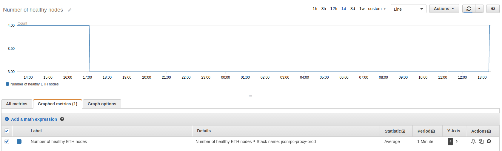

# Jak zbudować własną Infurą na AWS używając frameworku serverless

W [poprzednim artykule serii](https://www.rumblefishdev.com/how-to-run-ethereum-mainnet-node-on-aws/)
pokazaliśmy jak uruchomić pojednych node Parity na AWS. Dla większości zastosowań posiadanie jednego
własnego node'a Parity w zupełności wystarczy. To z pewnością lepszy pomysł niż poleganie na
niezawodności zewnętrznej publicznej infrastruktury, np Infury.

## Wady posiadania pojedyńczego pojedyńczego node'a Parity

Dla wielu przypadków posiadanie pojedyńczego node'a w zupełności wystarczy. Mimo to można wyobrazić
sobie sytuacje, kiedy będzie to za mało.

1. **Prace serwisowe**. Jeśli z dowolnego powodu wystąpi konieczność wyłączenia/restartu node'a ze względu na
prace administratorskie, aplikacja która od niego zależy nie będzie mogła działać.
Przykładem takiej sytuacji jest upgrade wersji Parity.

2. **Opóźnienie synchronizacji bloków**. Parity jest świetne ale nie jest doskonałe. Od czasu do czasu
zdarza mu się losowo wpaść w opóźnienie w stosunku do reszty sieci. Posiadanie więcej niż jednego node'a
pozwala wykryć taką sytuacje i przekierować ruch na node'y, które są zsynchronizowane.

3. **Rozdzielenie ruchu**. Pojedyńczy node może udźwignąć pewien określony poziom ruchu na interfejsie
json-rpc. Powyżej tego poziomu interfejs json-rpc staje się powolny i node zaczyna mieć problem z
utrzymaniem synchronizacji z resztą sieci.

## Struktura jsonrpc-proxy

Zgrubny obraz elementów, z których składa się nasze rozwiązanie:

1. Serwis utrzyuje listę urli naszych nodeów Parity w DynamoDB. Jeden URL jest specjalny i
oznaczony jako *leader*. W naszej konfiguracji jako leadera używamy publicznego node'a Infury.

2. Co 60 sekund wszystkie node'y na liście odpytywane są poprzez interfejs jsonrpc metodą
`eth_getBlockNumber`. Rezultat tego wywołania porównywany jest z leaderem. Node uznawany jest
jako "zdrowy" jeśli odpowie i jest opóźniony o niewięcej niż 10 bloków za leaderem.
*Health status* każdego node'a jest zapisywany w DynamoDB.

3. W przypadku wykrycia zmianu status node'a regenerowana jest konfiguracje proxy. Konfiguracja proxy
jest prostym plikiem `.conf` w formacie nginx, który konfiguruje serwis upstream, który rozkłada ruch
pomiędzy naszymi node'ami. W przypadku jeśli wszystkie nasze node'y zostałyby uznane za niezdrowe
jako fallback ruch jest przekierowywany do leadera, czyli do Infury.
Plik konfiguracyjny jest ładowany do bucketu S3.

4. Załadowanie nowego pliku konfiguracyjnego na S3 wywołuje lambdę, która uaktualnia definicje serwisou
ECS Service, który uruchamia naszego nginx z konfiguracją podaną jako ścieżka na S3.

### Monitorowowanie node'ów

AWS sam z siebie bez dodatkowej konfiguracji dostarcza wielu kilku metryk na temat
każdego serwisu, który uruchamia. Poniżej przykłady.

#### Ilość zapytań na sekundę

Nasz nginx podpięty jest do Elastic Load Balancer (ELB) i w metrykach tej usługi możemy znaleźć
rozkład zapytań na jednostkę czasu i status code odpowiedzi. Ten wykres dobrze mieć na dashboardzie
dla każdego serwisu, który uruchamiamy, bo mówi nam o poziomie ruchu który otrzymujemy.

#### Opóźnienie w stosunku do Infury

Dodatkowo jsonrpc-proxy wypycha do CloudWatcha własne metryki, które pozwalają nam obserwować jak
zachowuje się nasz klaster. Poniżej opóźnienie każdego z node'ów w stosunku do Infury.

#### Ilość zdrowych nodeów.

Kolejna metryka pokazuje ile nodeów w danym momencie jest zdrowe. Tej metryki używamy do ustawienia
alarmu, który powiadamia nas na Slacku, że dzieje się coś niedobrego.

## Jak stworzyć własną instancje na swoim koncie AWS

Kod naszego rozwiązania znajduje się w [repozytorium](https://github.com/rumblefishdev/jsonrpc-proxy).

### Wypchnij kontener dla nginx do repozytorium ECR

Nasz serwis uruchamia `nginx` w kontenerze na istniejącym klastrze ECS. Używamy w tym celu publicznego
obrazu z dockerhuba i odrobinę modyfikujemy go, żeby przy starcie pobierał konfiguracje ze ścieżki na
S3, którą przekazujemy jako zmienną środowiskową.
Obraz budowany i wypychany jest przy użyciu następujących komend:

    $ cd docker
    $ AWS_DEFAULT_PROFILE=yourProfileName bash -x build_and_upload.sh

Komenda powyżej utworzy repozytorium ECR, zbuduje obraz i go wypchnie. W odpowiedz zwróci
ARN utworzonego repozytorium, który należy wstawić do pliku konfiguracyjnego opisanego poniżej.

### Utwórz plik konfiguracyjny

Nasz serwis jest tak, żeby używać podanych wspólnych zasobów na Twoim koncie AWS. Przykładowo, nie
tworzymy własnego load balancera, ponieważ to koszt miesięczny koszt klikudziesięciu dolarów
miesięcznie i jeden w zupełności wystarczy.

Plik konfiguracyjny tworzy się z przykładu zamieszczonego w repozytorium:

    $ cd services
    $ cp config.yml.sample config.dev.yml # this assumes `dev` as stage name to be used later

Edytuj nowoutworzony plik i wstaw tam:

* Identyfikator Twojego VPC wrac z identyfikatorami prywatnych podsieci.

* Liste security group, które musi mieć lambda, żeby móc wykonać request do każdego z
  indywidualnych nodeów.

* Identyfikator klastra ECS, na którym odpalony będzie nginxa oraz Application Load Balancer.

*Ważne*: ECS cluster też musi być skonfigurowany tak, żeby można z niego wykonwać request do
każdego z nodeów. Jeśli Twoje node'y powstały z naszych przepisów, uruchomione są w prywatnej
podsieci i musisz dodać security groupy przez nie utworzone do listy grup klastra ECS.

* ARN repozytorium ECR utworzony w poprzednim korku.

### Uruchom serwis

Potrzebuje mieć bibliotekę `serverless` zainstalowaną globalnie w systemie.

    npm install -g serverless

Zainstaluj zależności naszego stacku:

    cd services
    npm install

Kiedy skończy się instalować wszystko jest gotowe, żeby uruchomić serwis na klastrze.

    $ AWS_DEFAULT_PROFILE=yourProfileName sls deploy -s dev

Ostatnim krokiem jest konfiguracja DNS, tak żeby nazwa po której chcesz się odwoływać do proxy
wskazywała jako CNAME na Application Load Balancer. Ten krok musisz wykonać w panelu administracyjnym
dla Twojej domeny.

### Konfiguracja urli monitorowanych node'ów

Kolejnym korkiem jest powiedzenie proxy, które node'y ma monitorować:

    $ DATA='{"body":"{\"url\":\"https://kovan.infura.io/kb56QStVQWIFv1n5fRfn\",\"is_leader\":true}"}'
    $ sls invoke -f add_backend -d $DATA -s dev
    {
      "statusCode": 201,
      "body": "{\"url\": \"https://kovan.infura.io/kb56QStVQWIFv1n5fRfn\", \"is_leader\": true, \"is_healthy\": false, \"when_added\": \"2018-07-02T11:50:47.762447\"}"
    }

    $ DATA='{"body":"{\"url\":\"http://kovan-parity-1.rumblefishdev.com:8545\",\"is_leader\":false}"}'
    $ sls invoke -f add_backend -d $DATA -s dev
    {
      "statusCode": 201,
      "body": "{\"url\": \"http://kovan-parity-1.rumblefishdev.com:8545\", \"is_leader\": true, \"is_healthy\": false, \"when_added\": \"2018-07-02T11:50:49.281928\"}"
    }

Jeśli wszystko działa prawidłowo, za ~5 minut powinieneś zobaczyć że monitoring zadziałał i że
skonfigurowane node'y są teraz zdrowe.

    $ sls invoke -f list_backends  | python -c "import sys,json; print(json.loads(sys.stdin.read())['body'])" | python -m "json.tool"
    [
        {
            "block_number": 7849400.0,
            "url": "http://kovan-parity-1.rumblefishdev.com:8545",
            "is_healthy": true,
            "is_leader": false,
            "when_added": "2018-07-02T11:50:49.281928"
        },
        {
            "block_number": 7849400.0,
            "url": "https://kovan.infura.io/kb56QStVQWIFv1n5fRfn",
            "is_healthy": true,
            "is_leader": true,
            "when_added": "2018-07-02T11:50:47.762447"
        }
    ]
